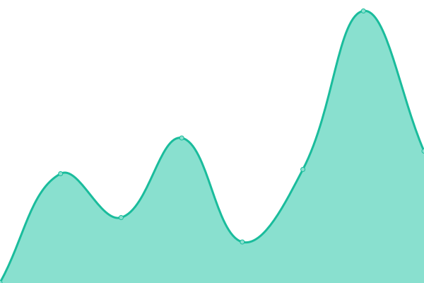
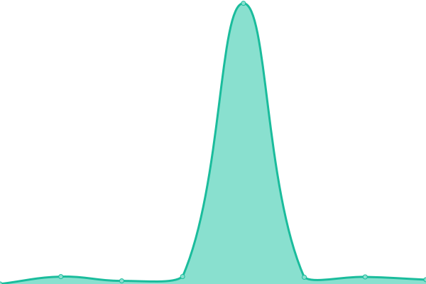
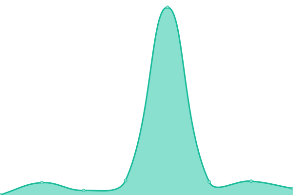

# [📈 Live Status](https://status.roveapi.com): <!--live status--> **All systems operational**

This repository contains the open-source uptime monitor and status page for [jg-noncelogic](https://status.roveapi.com), powered by [Upptime](https://github.com/upptime/upptime).

With [Upptime](https://upptime.js.org), you can get your own unlimited and free uptime monitor and status page, powered entirely by a GitHub repository. We use [Issues](https://github.com/jg-noncelogic/rove-upptime/issues) as incident reports, [Actions](https://github.com/jg-noncelogic/rove-upptime/actions) as uptime monitors, and [Pages](https://status.roveapi.com) for the status page.

<!--start: status pages-->
<!-- This summary is generated by Upptime (https://github.com/upptime/upptime) -->
<!-- Do not edit this manually, your changes will be overwritten -->
<!-- prettier-ignore -->
| URL | Status | History | Response Time | Uptime |
| --- | ------ | ------- | ------------- | ------ |
|  [Rove Web](https://roveapi.com) | 🟩 Up | [rove-web.yml](https://github.com/jg-noncelogic/rove-upptime/commits/HEAD/history/rove-web.yml) | 

 459ms
     
 | 

<a href="https://status.roveapi.com/history/rove-web">100.00%</a>
    

|  [Rove API](https://rove-api.fly.dev/health) | 🟩 Up | [rove-api.yml](https://github.com/jg-noncelogic/rove-upptime/commits/HEAD/history/rove-api.yml) | 

 645ms
     
 | 

<a href="https://status.roveapi.com/history/rove-api">100.00%</a>
    

|  [Rove API (v1)](https://rove-api.fly.dev/v1/account/usage) | 🟩 Up | [rove-api-v1.yml](https://github.com/jg-noncelogic/rove-upptime/commits/HEAD/history/rove-api-v1.yml) | 

 145ms
     
 | 

<a href="https://status.roveapi.com/history/rove-api-v1">100.00%</a>
    

<!--end: status pages-->

[**Visit our status website →**](https://status.roveapi.com)

## 📄 License

- Powered by: [Upptime](https://github.com/upptime/upptime)
- Code: [MIT](./LICENSE) © [Anand Chowdhary](https://anandchowdhary.com), supported by [Pabio](https://pabio.com)
- Data in the `./history` directory: [Open Database License](https://opendatacommons.org/licenses/odbl/1-0/)
